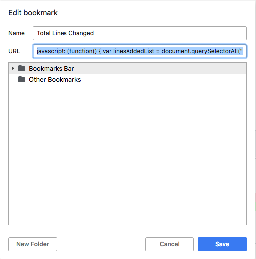

# Bitbucket Bookmarklet

This is javascript that can be saved as a bookmark to see the total of lines added and removed from a Bitbucket pull request.

To use/install this bookmarklet, you will need to create new bookmark and paste the code from the linesChanged.js file into the URL input.

